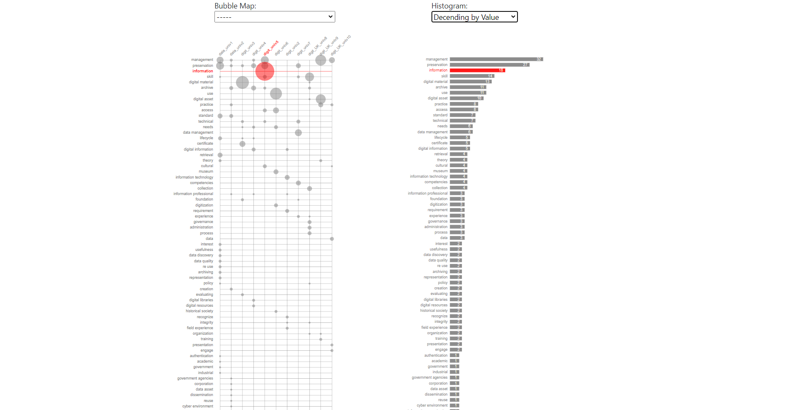

# Bubble Map using D3.js

Interactive Bubble Map showing the frequency of terms in different university courses.

# Preview

# Demo

## [Bubble Map Demo](https://santhoshnandha.github.io/UnivPrograms-BubbleMap/)
